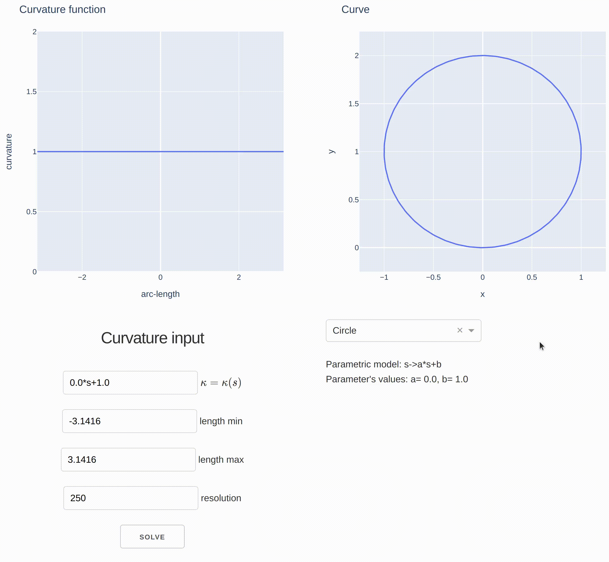

# Curvature2D.jl

This Julia-Dash App constructs a curve with a given curvature function.



You can execute the app from the Julia REPL by typing

```
julia> using Pkg
julia> Pkg.activate(".")
julia> Pkg.instantiate()
julia> include("app.jl")
```

and then opening your browser at http://localhost:8050/
